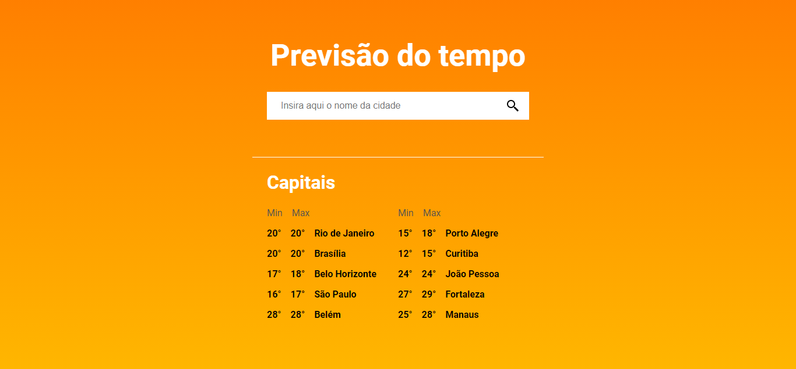
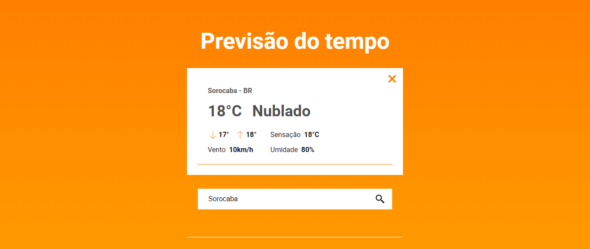
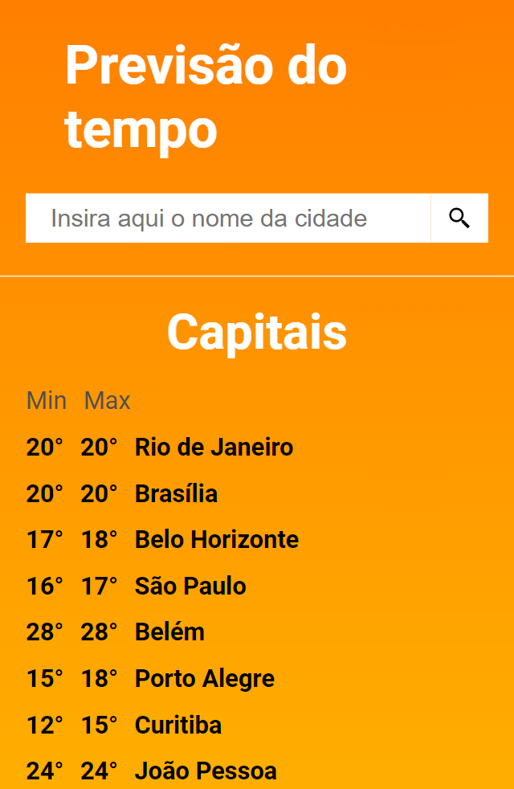
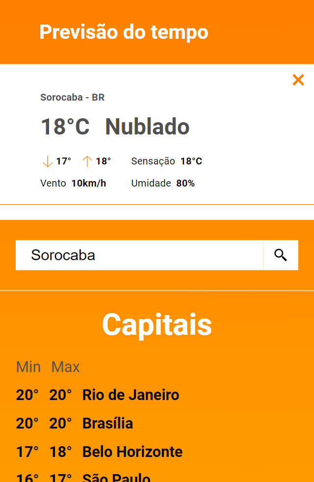

<h1 align="center">
    Desafio Frontend
</h1>
<h1 align="center">
    
</h1>

<p align="center">
    <a href="#headphones-about">About</a> •
    <a href="#computer-layout">Layout</a> •
    <a href="#rocket-getting-started">Getting Started</a> • 
    <a href="#microscope-technologies">Technologies</a> • 
    <a href="#pencil2-author">Author</a> • 
    <a href="#pencil-license">License</a>
</p>

## :headphones: About

The challenge consist in an app to search a city and get its weather information.

---

## :computer: Layout

This is the challenge layout

### :globe_with_meridians: Web

<p align="center">
  

  
</p>

### :iphone: Web Mobile

<p align="center" style="display: flex; align-items: flex-start; justify-content: space-around;">
  

  
</p>

---

## :rocket: Getting Started

### Requirements

-   You need to install both [Node.js](https://nodejs.org/en/download/) and [Yarn](https://yarnpkg.com/) to run this project.

**Clone the project and access the folder**

```bash
$ git clone https://github.com/FabioRamos12/challenge-front.git && cd challenge-front
```

**Follow the steps below**

```bash
# Install the dependencies
$ yarn

# Run the project
$ yarn start
```

The app will be available for access on your browser at `http://localhost:3000`

---

## :microscope: Technologies

This project was developed using the following technologies:

-   [React](https://reactjs.org)
-   [TypeScript](https://www.typescriptlang.org/)
-   [Styled Components](https://styled-components.com/)
-   [Axios](https://axios-http.com/docs/intro)

---

## :pencil2: Author

 
 <span>Fabio Ramos</span>

[](https://www.linkedin.com/in/fabioalvesramos/)
[](mailto:fabioalvesramos12@gmail.com)

---

## :pencil: License

This project is under the license [MIT](./LICENSE).

---

```

```
